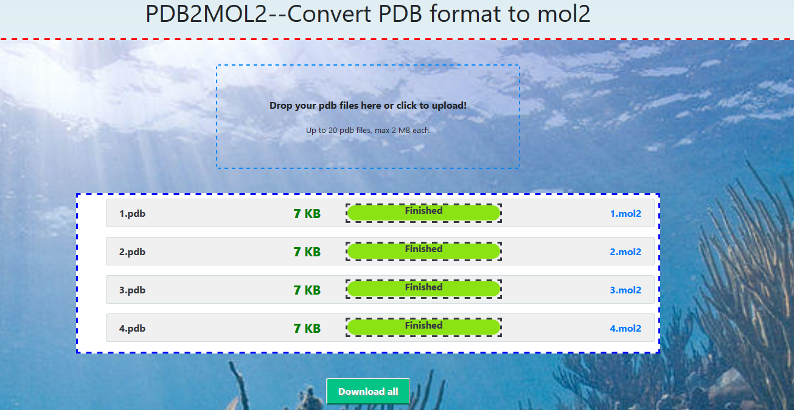

# PDB2MOL2APP

# 项目简介
[pdb2mol2APP](http://pdb2mol2.chenzhaoqiang.com/) 借助openbabel把pdb文件转换成mol2文件的网络服务。

# 网站
pdb2mol2: <http://pdb2mol2.chenzhaoqiang.com/>

# 环境
系统： win/linux
语言： python2/python3
依赖： flask celery dropzoneJS  
后台程序：
1. 7-zip;命令名字统一为7z;
2. openbabel;后台命令名字统一为obabel.

# 部署步骤
step1. 安装redis并启动redis服务
检测是否启动成功，
redis-cli ping 返回pong 说明安装成功
step2. 配置项目环境
step2.1 下载项目
step2.2 激活环境 pipenv shell
step2.3 下载依赖模块 pipenv install
step3 运行
flask run 或者 python -m flask run 启动flask app
celery worker -A app.celery -P eventlet -l info

# 注意事项
1. python相关命令来自于虚拟环境中, 如 which python;python -m flask; 进行检测

# 下一步计划
1. 拆分app.py, 采用包模式组织代码。

# 关于作者/组织及交流方式等信息
微信公众号：pythonperl;

QQ群：719129777  加群请备注项目名，并修改名字 pdb2mol2_qq名

